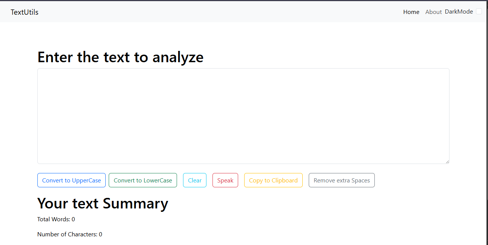

# TextUtils 📝

[](https://reactjs.org/)
[](https://developer.mozilla.org/en-US/docs/Web/JavaScript)
[](https://developer.mozilla.org/en-US/docs/Web/HTML)
[](https://developer.mozilla.org/en-US/docs/Web/CSS)
[](https://getbootstrap.com/)

[](https://rajath2005.github.io/textutils.io/)
[](https://github.com/Rajath2005/textutils.io)

> A powerful and intuitive text manipulation tool built with React. Transform, analyze, and format your text effortlessly with a modern, user-friendly interface.

## 🖼️ Demo




## ✨ Features

- **🔄 Text Transformation** - Convert to uppercase, lowercase, or capitalize
- **🧹 Text Cleaning** - Remove extra spaces and format text
- **📊 Analytics** - Real-time word and character counting
- **🔊 Text-to-Speech** - Listen to your text with built-in TTS
- **📋 Clipboard Integration** - One-click copy functionality
- **🌙 Dark Mode** - Eye-friendly dark theme support
- **📱 Responsive Design** - Works seamlessly on all devices

## 🚀 Quick Start

```bash
# Clone the repository
git clone https://github.com/Rajath2005/textutils.io.git

# Navigate to project directory
cd textutils.io

# Install dependencies
npm install

# Start development server
npm start
```

Visit `http://localhost:3000` to see the app in action.

## 🛠️ Built With

- **React** - Frontend framework
- **Bootstrap** - UI styling
- **JavaScript ES6+** - Core functionality
- **Web Speech API** - Text-to-speech feature

## 📦 Scripts

| Command | Description |
|---------|-------------|
| `npm start` | Run development server |
| `npm run build` | Build for production |
| `npm test` | Run test suite |
| `npm run deploy` | Deploy to GitHub Pages |

## 🌐 Live Demo

Experience TextUtils live: **[https://rajath2005.github.io/textutils.io/](https://rajath2005.github.io/textutils.io/)**

## 🤝 Contributing

Contributions are welcome! Please feel free to submit a Pull Request.

1. Fork the project
2. Create your feature branch (`git checkout -b feature/AmazingFeature`)
3. Commit your changes (`git commit -m 'Add some AmazingFeature'`)
4. Push to the branch (`git push origin feature/AmazingFeature`)
5. Open a Pull Request

## 📄 License

This project is licensed under the MIT License - see the [LICENSE](LICENSE) file for details.

## 👨‍💻 Author

**Rajath**
- GitHub: [@Rajath2005](https://github.com/Rajath2005)
- Email: rajathajeru@gmail.com

---

<div align="center">
  <strong>⭐ Star this repository if you found it helpful!</strong>
</div>
